# BusinessOS Architecture

Date: 2026-05-06

## Current Architecture Status

BusinessOS currently includes two active MVP modules:

- Finance Module MVP v1.0
- Operations Module MVP v1.0 in progress

The system runs as a local modular Python backend with SQLite storage, CLI commands, audit logs, reports, health checks, and smoke tests.

## Core Pattern

BusinessOS follows a reusable operating-system pattern:

1. Ingest or create state.
2. Store normalized records.
3. Evaluate rules.
4. Generate actions or tasks.
5. Track status.
6. Store justification.
7. Generate KPIs.
8. Detect risk or escalation.
9. Produce executive/operator briefs.
10. Write audit logs.
11. Expose commands through CLI.
12. Validate through smoke tests.

## Current Modules

```text
app/
  audit/
  db/
  ingest/
  rules/
  actions/
  reports/
  operations/
scripts/
docs/
reports/
data/
```

## Architecture Diagram

```mermaid
flowchart TD
    CLI["cli.py"] --> MAIN["main.py Finance Orchestrator"]
    CLI --> HEALTH["scripts/health_check.py"]
    CLI --> SMOKE["scripts/smoke_test.py"]
    SMOKE --> CLI

    CSV["data/raw/sample.csv"] --> INGEST["app/ingest/csv_loader.py"]
    INGEST --> DB["finance.db SQLite"]

    MAIN --> SCHEMA["app/db/schema.py"]
    MAIN --> INGEST
    MAIN --> CASHFLOW["app/rules/cash_flow.py"]
    MAIN --> FINRISKS["app/rules/financial_risk_rules.py"]
    MAIN --> ANOMALY["app/rules/anomaly_rules.py"]
    MAIN --> ACTIONS["app/actions/recommended_actions.py"]
    MAIN --> ACTIONSTATUS["app/actions/action_status.py"]
    MAIN --> ACTIONVIEWS["app/actions/action_views.py"]
    MAIN --> FINBRIEF["app/reports/executive_brief.py"]
    MAIN --> EXPORT["app/reports/report_export.py"]
    MAIN --> HISTORY["app/reports/report_history.py"]

    SCHEMA --> DB
    CASHFLOW --> DB
    FINRISKS --> DB
    ANOMALY --> DB
    ACTIONS --> DB
    ACTIONSTATUS --> DB
    ACTIONVIEWS --> DB
    FINBRIEF --> DB

    FINBRIEF --> EXPORT
    EXPORT --> REPORTFILES["reports/daily_brief_YYYY-MM-DD.md"]
    HISTORY --> REPORTFILES

    OPS_SCHEMA["app/operations/schema.py"] --> DB
    OPS_TASKS["app/operations/tasks.py"] --> DB
    OPS_STATUS["app/operations/task_status.py"] --> DB
    OPS_VIEWS["app/operations/task_views.py"] --> DB
    OPS_ESC["app/operations/escalation_rules.py"] --> DB
    OPS_BRIEF["app/operations/operations_brief.py"] --> DB

    CLI --> OPS_VIEWS
    CLI --> OPS_ESC
    CLI --> OPS_BRIEF

    AUDIT["app/audit/audit_log.py"] --> DB
    MAIN --> AUDIT
    ACTIONSTATUS --> AUDIT
    OPS_TASKS --> AUDIT
    OPS_STATUS --> AUDIT
    OPS_VIEWS --> AUDIT
    OPS_ESC --> AUDIT
    OPS_BRIEF --> AUDIT
```



## Finance Module

Finance handles:

- CSV transaction ingestion.
- Cash flow summary.
- Financial risk detection.
- Expense anomaly detection.
- Recommended actions.
- Action status workflow.
- Daily executive brief.
- Report export.
- Report history.

## Operations Module

Operations handles:

- Operations tasks.
- Owners.
- Priorities.
- Deadlines.
- Status tracking.
- Status justification.
- Task list.
- Task KPIs.
- Escalation rules.
- Operations brief.

## CLI Commands

Current CLI commands:

```bash
python cli.py run
python cli.py health
python cli.py actions
python cli.py reports
python cli.py ops-tasks
python cli.py ops-escalations
python cli.py ops-brief
```

## Verification

Main verification command:

```bash
python scripts/smoke_test.py
```

Expected result:

```text
Smoke test completed successfully.
```

## Current Strategic Direction

Finance is the first closed module.

Operations is the second module and acts as the bridge toward:

- Governance Layer.
- Operative Support System.
- Protected Incident Mode.
- Cross-module workflows.

