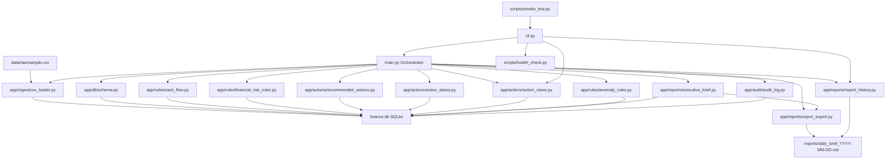

# Finance MVP Status

Date: 2026-05-05

## Current Status

The BusinessOS Finance Module MVP is operational as a local modular backend.

The system can ingest financial transactions, store them in SQLite, evaluate financial rules, generate recommended actions, export executive reports, and write audit logs for traceability.

## Verified Runtime

Main command:

```bash
python main.py
## CLI Layer

A small CLI entry point has been added:

```bash
python cli.py <command>
```

Available commands:

```bash
python cli.py run
python cli.py health
python cli.py actions
python cli.py reports
```

Verified commands:

- `python cli.py health`
- `python cli.py actions`
- `python cli.py reports`
- `python cli.py run`

The CLI allows the Finance module to be used as an operational tool instead of only running the full workflow through `main.py`.
## Smoke Test

A smoke test script has been added:

```bash
python scripts/smoke_test.py
```

Verified result:

```text
Smoke test completed successfully.
```

The smoke test validates:

- Health check command.
- Actions command.
- Reports command.
- Full run command.
## Action Status Justification

Recommended action status updates now support justification.

The `recommended_actions` table includes:

```text
status_justification
```

The status update function accepts:

```python
update_recommended_action_status(
    conn,
    action_id,
    new_status,
    justification=None,
)
```

When a status changes, the system stores:

- Old status.
- New status.
- Status justification.
- Recommended action.
- Action ID.

The justification is also written to the audit log under:

```text
recommended_action_status_updated
```

This strengthens the audit trail for governance and future institutional workflows.
## Architecture Diagram


